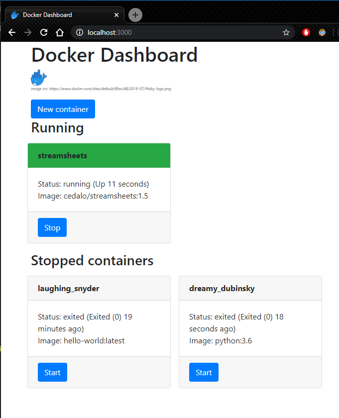
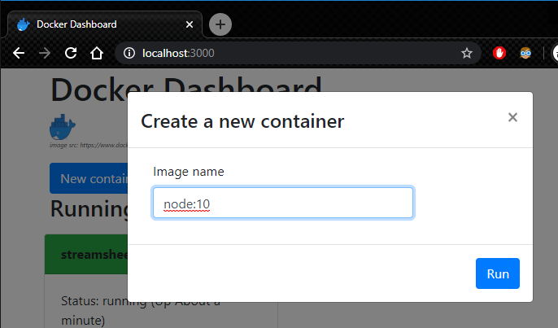

# Docker Dashboard

based on the https://github.com/stevehobbsdev/docker-dashboard-example.git

sample docker image to be found under: 

https://hub.docker.com/r/santhoshdse/docker-dashboard

the sample is extended to support Bootstrap 4.x

this repo includes following technologies:

1. Nodejs
2. Express
3. Typescript
4. React
5. Socket.io
6. Webpack
7. Bootstrap 4.x
8. Docker

## Software 

**Node 12.16.1**

**Webpack 4.43.0**

```
npm install -g webpack
```

**Typescript 3.8.3**

```
npm install -g typescript
```

Clone the project, then run:

```
npm install
npm link typescript
```

## Starting instructions
Make sure to update the dockerapi.js file to the correct IP-Address, in case of Windows OS system.

```
npm start
```

### Sample images
|Description|Image|
|-----|-----|
|Home page||
|Container run||
